# Monitor Azure Kubernetes Service(AKS) with Prometheus and Grafana

This project aims to deploy a monitoring system for AKS and access Grafana dashboards using a custom domain. In this case, you need to own a domain, which you can purchase from various websites. I have created my domain using [GoDaddy](https://account.godaddy.com/) and will be used here.

- [Monitor Azure Kubernetes Service(AKS) with Prometheus and Grafana](#monitor-azure-kubernetes-serviceaks-with-prometheus-and-grafana)
  - [Setting up AKS cluster](#setting-up-aks-cluster)
  - [Installing Helm packages](#installing-helm-packages)
  - [Create self signed certificate](#create-self-signed-certificate)
  - [Creating Ingress objects](#creating-ingress-objects)
  - [Adding DNS records](#adding-dns-records)
  - [Log into Grafana](#log-into-grafana)
  - [Create a Service Principal and Assign Role](#create-a-service-principal-and-assign-role)
  - [Create Azure Monitor Data Source](#create-azure-monitor-data-source)
  - [View the metrics in the dashboards](#view-the-metrics-in-the-dashboards)
  - [Clean up the resources](#clean-up-the-resources)
  - [References](#references)


## Setting up AKS cluster

> Please note that all the following commands are designed for the Bash shell.

When creating the cluster need to enable `azure-keyvault-secrets-provider` and  `web_application_routing` add-ons to create ingress objects in the cluster. By enabling them, `nginx` ingress-controller will be deployed automatically.

```
RESOURCE_GROUP="grafana"
CLUSTER_NAME="grafana"
SUBSCRIPTION_ID=$(az account show --query id --output tsv)


az group create -l eastus -n $RESOURCE_GROUP

az aks create --name $CLUSTER_NAME -g $RESOURCE_GROUP --tier free --node-count 1 --node-vm-size Standard_B2s --network-plugin azure   --load-balancer-sku basic --node-osdisk-size 30 --enable-cluster-autoscaler --max-count 5 --min-count 1  --enable-addons azure-keyvault-secrets-provider  web_application_routing
```
> You might need to add the extension `aks-preview` before running the following commands.

```
az extension add --upgrade -n aks-preview
```

Enable the addons:
```
az aks addon enable --name $CLUSTER_NAME -g $RESOURCE_GROUP --addon  web_application_routing

az aks addon enable --name $CLUSTER_NAME -g $RESOURCE_GROUP --addon  azure-keyvault-secrets-provider
```


Use the following commands to authenticate with the cluster.

```
az aks get-credentials --resource-group $RESOURCE_GROUP --name $CLUSTER_NAME --overwrite-existing
```

Verify proper authentication with the cluster.

```
kubectl get nodes

kubectl get pods -A
```

## Installing Helm packages

Deploy Grafana and Prometheus applications using the following commands.

This chart will install,

- Grafana
- Prometheus
- Node Exporter
- Kube State Metrics
- Alert Manager

```
helm repo add prometheus-community https://prometheus-community.github.io/helm-charts

helm repo update

helm repo list

kubectl create ns monitoring

helm install prometheus prometheus-community/kube-prometheus-stack -n monitoring
```

## Create self signed certificate

Let's create a self signed certificate to use in our domain.

To create a certificate you need a key vault. If you don't have a key-vault yet, create one by using the following command.

```
az keyvault create -n your-kv-name -g $RESOURCE_GROUP -l eastus
```

Now navigate to the key-vault you created earlier from the azure portal :arrow_right: Certificates :arrow_right: Generate/Import

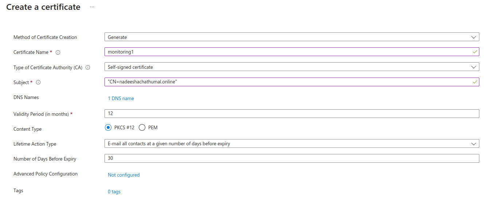

Provide your host domain name under "Subject". Add the monitoring URL that you are planning to use with Grafana under `DNS names`.

I'm using `monitoring.nadeeshachathumal.online` as the Grafana URL here.

## Creating Ingress objects

Navigate to AKS cluster :arrow_right: Go to Services and Ingresses

Select the service (in this case `prometheus-grafana`) and select `Add ingress`. Note the `Nginx` service which is exposed as a LoadBalancer and its `ExternalIP`.

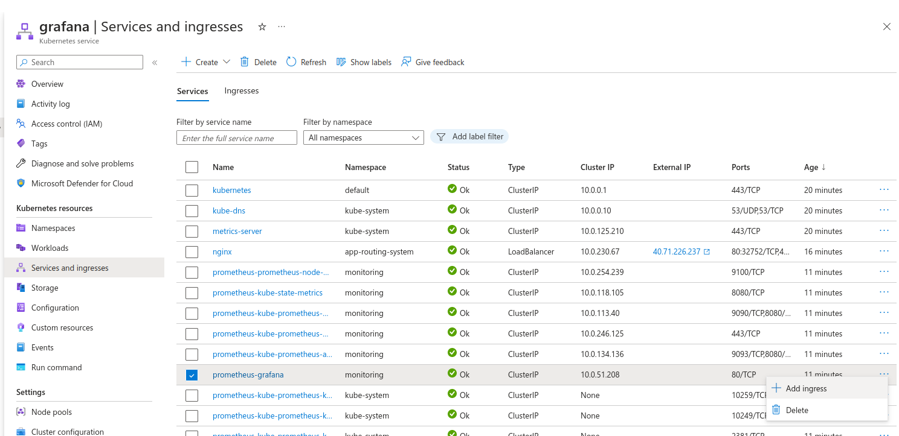

Add the certificate details (key vault and the certificate) which were created earlier.

Add the hostname for this service as shown below. As described above, I'm using a hosted domain so I have selected the DNS provider as a "3rd Party Provider".

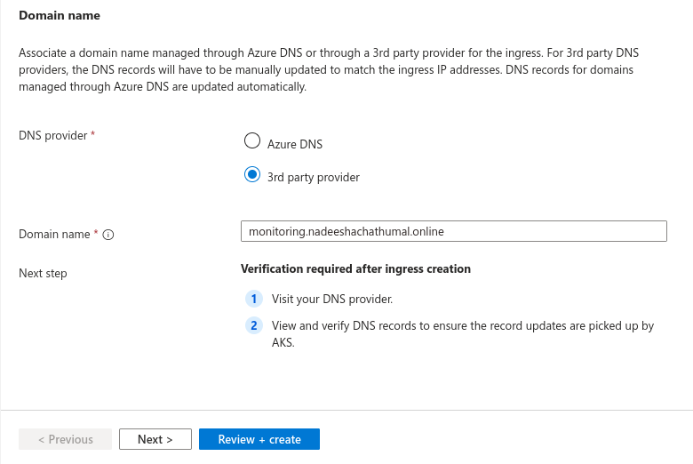

The ingress resource will be created as follows.

```yaml
kind: Ingress
apiVersion: networking.k8s.io/v1
metadata:
  name: grafana
  namespace: monitoring
  annotations:
    kubernetes.azure.com/tls-cert-keyvault-uri: https://xxxx.vault.azure.net/certificates/monitoring1
spec:
  ingressClassName: webapprouting.kubernetes.azure.com
  tls:
    - hosts:
        - monitoring.nadeeshachathumal.online
      secretName: keyvault-grafana
  rules:
    - host: monitoring.nadeeshachathumal.online
      http:
        paths:
          - path: /
            pathType: Prefix
            backend:
              service:
                name: prometheus-grafana
                port:
                  number: 80
```

## Adding DNS records

Now log into the DNS management section in your Domain provider. Add an `A record` indicating the public IP address obtained above (ExternalIP address of Nginx Service).

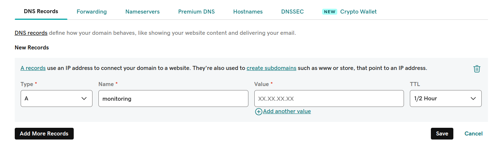

In the value section you need to provide the IP address.


## Log into Grafana

Now log into the Grafana using the URL (<https://monitoring.nadeeshachathumal.online>)

Since we have generated a self-signed certificate for our domain, the following warning will be received.

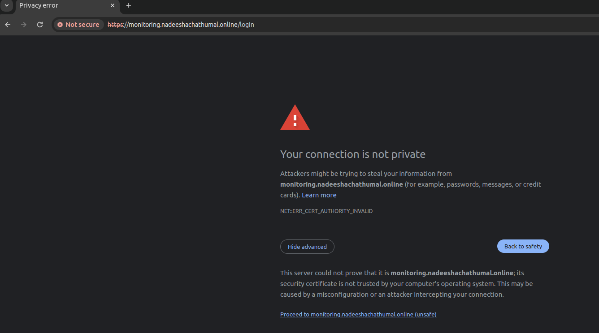

Click on 'Proceed' to move forward and you will be directed to the Grafana login page.


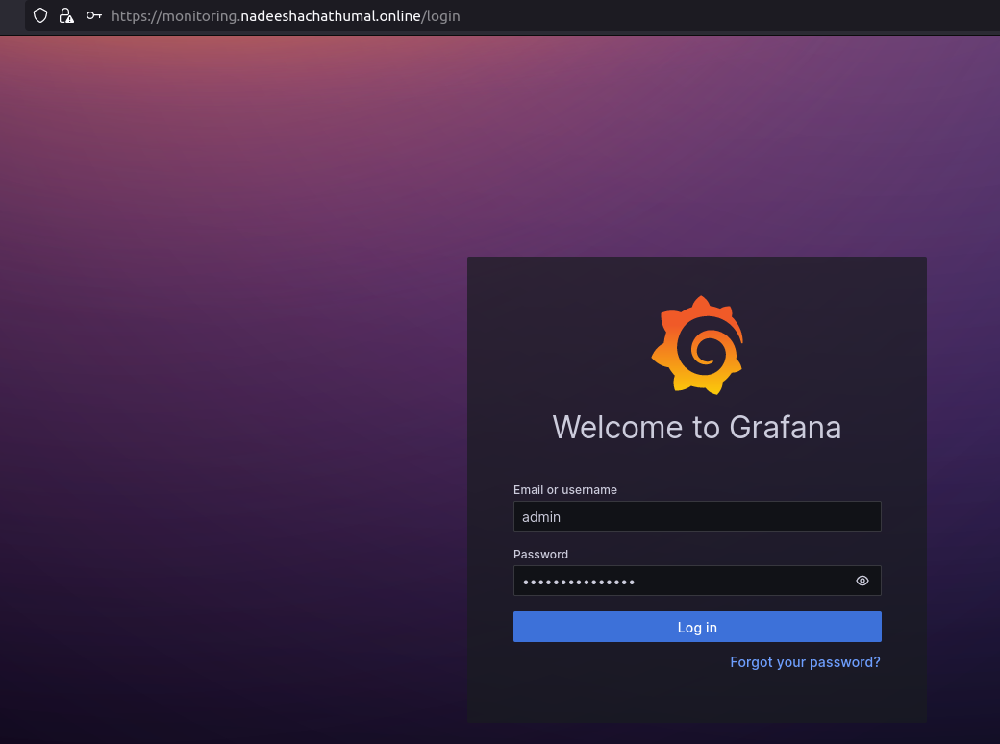

Obtain the Grafana credentials using the following commands.


**admin username**  :arrow_down:
```
kubectl get secret -n monitoring prometheus-grafana -o=jsonpath='{.data.admin-user}' |base64 -d
```

**admin password** :arrow_down:
```
kubectl get secret -n monitoring prometheus-grafana -o=jsonpath='{.data.admin-password}' |base64 -d
```


## Create a Service Principal and Assign Role

We need to create a `Service Principal` with `Monitoring Reader` role to the scope of AKS resource group. When we create the Azure datasource, we need to mention this Service Principal credentials.

```
az ad sp create-for-rbac -n Azure-Datasource --role "Monitoring Reader" --scopes "/subscriptions/$SUBSCRIPTION_ID/resourceGroups/$RESOURCE_GROUP"
```
Save the output of this command. It will be required in the following steps.

you can even verify the status of the role assignment.

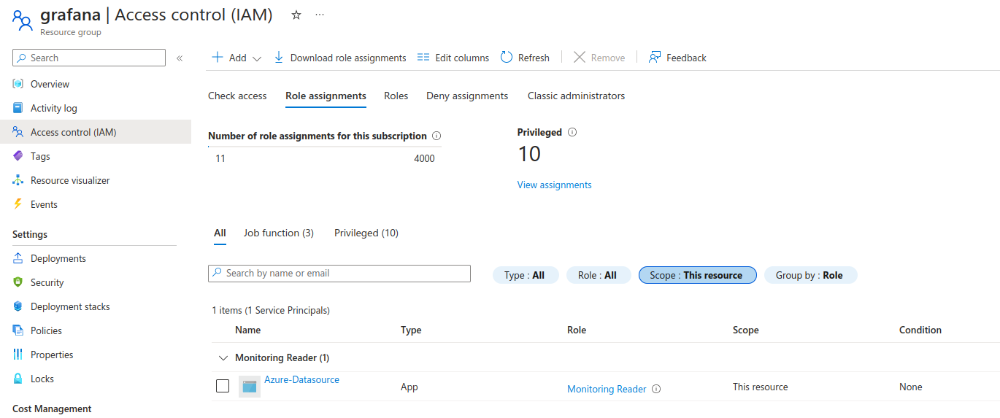


## Create Azure Monitor Data Source

Go to the configuration panel and select data sources. You will see some datasources are already there, which were detected automatically may be due to the endpoints being in the same namespace.

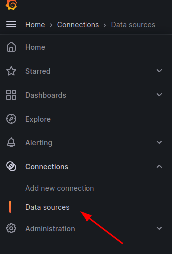

Following datasources are already there.

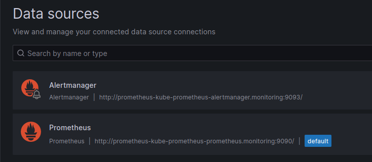

**In addition to monitoring 'AKS metrics' you will be able to monitor other Azure resources as well. Ex: Key vaults, Networks etc.** To do that we need to add "Azure monitor" as a data source.

Since we selected the scope as the 'Resource Group' level while creating the service principal, those resources should be in the same resource group identified by the "$RESOURCE_GROUP" env variable.

In the "data sources" tab :arrow_right: Select "Add new datasource" :arrow_right: Search for "Azure Monitor"

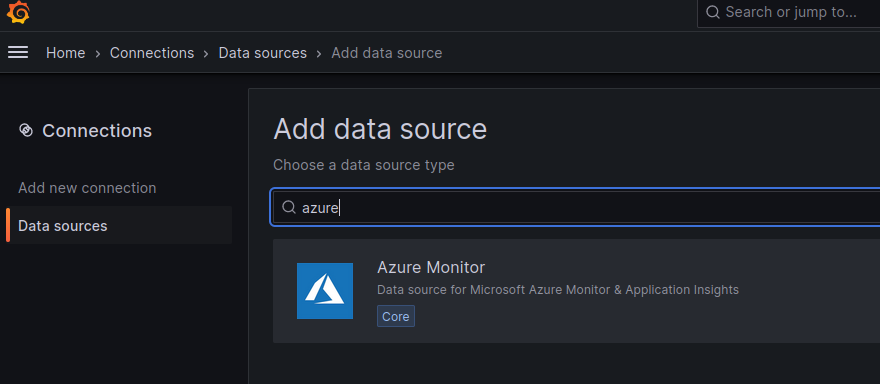

Provide the output details obtained [here](#create-a-service-principal-and-assign-role)

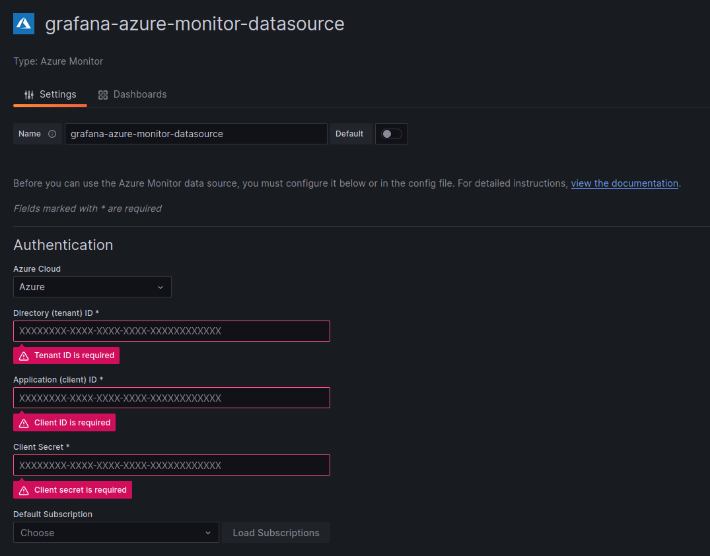

Select the `Dashboards` section as seen in the above image and import 
**"Azure Monitor / Container Insights / Syslog"**.

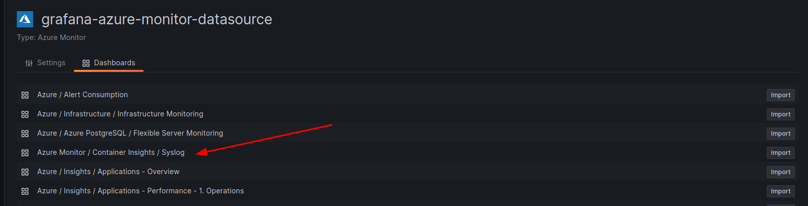

## View the metrics in the dashboards

After adding the data source is successful, you can navigate to the dashboards section and you will find several dashboards including the imported one in the earlier step.

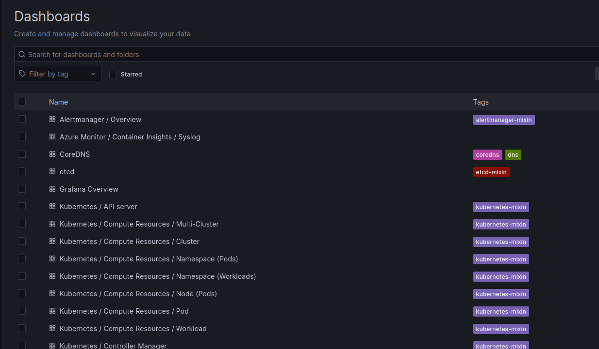

Select a dashboard to view metrics.

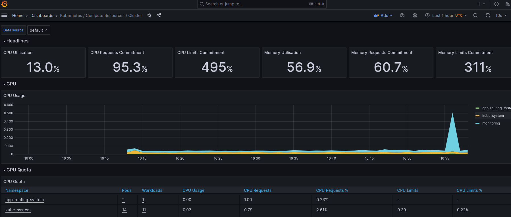

## Clean up the resources

```
az aks delete --name $CLUSTER_NAME  --resource-group $RESOURCE_GROUP --no-wait
az group delete -n $RESOURCE_GROUP --no-wait

# delete service principal
az ad sp delete --id <appId of the service principal created above>

# delete the app registration (AAD app) associated with the above service principal
az ad app delete --id <appId of the service principal created above>
```

**Remember to clean the DNS record**.


## References

1. [AZ CLI Documentation](https://learn.microsoft.com/en-us/cli/azure/reference-index?view=azure-cli-latest)